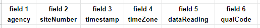

# Module 6 Lab Guide (part 1)
[Lab Introduction Video](https://boisestate.hosted.panopto.com/Panopto/Pages/Viewer.aspx?id=1f5577fb-fcec-43c7-beb5-ae290012b284&start=0)  

### Code Style Requirements
Please review the [CS121 Style Guide](https://docs.google.com/document/d/1LWbGQBKkApnNAzzgwOSvRM03DmhYWx5yEfecT2WXfjI/edit?usp=sharing) and apply it in all lab activities and projects this semester. Coding Style will assessed as part of your lab and project grades.

### Code Quality Requirements
- Code must compile without warnings using openjdk11
- Code must run without errors or warnings on safe-path and edge test cases
- More to come as we learn about input validation and exception handling 

## Lab Warmup - FlowSampleEntry
[Walkthrough Video](https://boisestate.hosted.panopto.com/Panopto/Pages/Viewer.aspx?id=858929c6-5516-4953-b510-ae2900e8ed31&start=0)  
### Problem Description
Create a class called FlowSample that represents a single, point-in-time snapshot, of USGS river flow water data. For this lab we will be using data collected from the [Boise River at the Glenwood Bridge](https://waterdata.usgs.gov/monitoring-location/13206000/#parameterCode=00060&period=P7D). A sample data file containing 7 days worth of samples has been included. Detailed information on the format of this information can be found on the [USGS NWIS Help Site](http://help.waterdata.usgs.gov/faq/about-tab-delimited-output). 

Each sample contains the following values:
- Agency
- SiteNumber
- Timestamp
- TimeZone
- FlowRate (cubic ft / sec)
- QualificationCode
    - **P** means provisional value, subject to change
    - **A** means approved value, ready for publication

### Program Design
#### Instance Variables
The FlowSample class will represent a single sample of data.  It should contain private instance variables for each of the above sample values with data types as follows:
- **String**: agency, siteNumber and qualCode
- **double**: flowRate
- **Date**: timestamp

#### Constructor
The constructor for FlowSample should be an initial value constructor with the following signature:
```
public FlowSample(String agency, String siteNumber, String timeZone, String qualCode, String timestamp, double flowRate)
```
A SimpleDateFormat object should be created to match the format of the USGS timestamp value and apply the correct TimeZone configuration. The following code shows how to create the required SimpleDateFormat object.
```
SimpleDateFormat myFormatter = new SimpleDateFormat("yyyy-MM-dd HH:mm");
myFormatter.setTimeZone(TimeZone.getTimeZone(timeZone));
```
You can then use the parse() method of the SimplerDateFormat object to create a Date object from the timestamp String data. This can throw a ParseError exception. If this occurs, catch the exception, display an error message in the console and instantiate a new Date object configured for the epoch and assign it to the timestamp instance variable as shown in the code below:

```
try
{
    this.timestamp = myFormatter.parse(timestamp);
}
catch (ParseException e) 
{
    System.out.println("Error: Unable to parse timestamp: " + timestamp);
    /* Initialize timestamp with the epoch, January 1, 1970, 00:00:000 GMT */
    this.timestamp = new Date(0);
}
```

**Note:**  We're introducing a few new classes here to help us work more effectively with the timestamp data. Specifically they are the [Date](https://docs.oracle.com/javase/8/docs/api/java/util/Date.html), [TimeZone](https://docs.oracle.com/javase/8/docs/api/java/util/TimeZone.html) and [SimpleDateFormat](https://docs.oracle.com/javase/8/docs/api/java/text/SimpleDateFormat.html). Depending upon the semester, we may or may not introduce these classes in Module 3. However, these classes are sufficiently covered in the walkthrough video to satisfy the requirements of this lab even if we did not specificly present these classes in the lecture videos this semester.  :)

#### Getters and Setters
Once created, a sample should not be able to be modified, so no mutator (setter) methods should be created. However accessor (getter) methods should be created for each of the instance variables except timeZone and timeStamp.The following lists the required accessor methods for the FlowSample class
```
public String getAgency() {...}
public String getSiteNumber() {...}
public double getFlowRate() {...}
public String getQualCode() {...}
```

#### Other Methods
Instead of writing a simple accessor method called getTimestamp that returns a reference to the Date object, it is more useful to provide methods that can process the timestamp and time zone information appropriately and return a String value with a custom date and time format.  Use the javadoc comments below to implement the required functionality. Again, these methods utilize the  [TimeZone](https://docs.oracle.com/javase/8/docs/api/java/util/TimeZone.html) and [SimpleDateFormat](https://docs.oracle.com/javase/8/docs/api/java/text/SimpleDateFormat.html) classes and their usage is presented in the walkthrough video. :)
```
/**
 * Return a String representation of the timestamp with the following
 *     custom format: "EEE dd MMM yyyy hh:mm:ss a z"
 * 
 *     The timezone value should remain unchanged
 * 
 *     Example: Thu 30 Dec 2021 02:30:00 PM MST
 *
 * @return Timestamp with custom format
 */
public String getTimestamp() {...}
```
```
/**
 * Return a String representation of the timestamp with the following
 *     custom format: "EEE dd MMM yyyy hh:mm:ss a z"
 * 
 *     The timezone value should adjusted to UTC
 * 
 *     Example: Thu 30 Dec 2021 09:30:00 PM UTC
 *
 * @return UTC Timestamp with custom format
 */
public String getUTCTimestamp() {...}
```

Add a toString() method that represents the FlowSample object as a nicely formatted String as shown in the javadoc comment below
```
/**
 * Return a String representation of the current FlowSample object
 *    using the following template:
 *
 *    ### <agency> - <siteNumber> ###
 *    Timestamp: <UTCTimeStamp>
 *    Flow Rate: <flowRate>
 *
 * @return String value representing this FlowSample object
 */
 public String toString() {...}
```

#### Driver class ####
Once the FlowSample class has been created, add code to the main() method in FlowSampleEntry.java that uses a Scanner object to prompt the user for each of the data values, creates a new FlowSample object, then calls each of the accessor methods and the toString method and displays the results in the console.

##### Expected Program Output (with sample user input)
```
---------------------
|    Data Entry     |
---------------------
Please enter the following sample data values
Agency: USGS
Site Number: 13206000
Timestamp: 2021-12-30 14:30
Time Zone: MST
Flow Rate: 226
Qualification Code: P

---------------------
| Data Confirmation |
---------------------
You entered the following:
Agency: USGS
Site Number: 13206000
Timestamp: Thu 30 Dec 2021 02:30:00 PM MST
UTC Timestamp: Thu 30 Dec 2021 09:30:00 PM UTC
Flow Rate: 226.0
Qualification Code: P

---------------------
|  Sample Summary   |
---------------------
### USGS - 13206000 ###
Timestamp: Thu 30 Dec 2021 09:30:00 PM UTC
Flow Rate: 226.0

```

### Implementation Guide
1. Expand the folder named FlowSampleEntry and open both FlowSample.java and FlowSampleEntry.java
2. Design a program to satisfy the requirements in the Problem Description and Program Design sections
3. Test the program using the sample user input and compare against the expected output.
4. Commit the changes to your local repository with a message stating that Lab Warmup is completed.
5. Push the changes from your local repository to the github classroom repository.

## Lab Activity 1 - FlowSampleParser
### Problem Description
The USGS provides FlowSample data in tab-delimited lines of text where each data field is separate by tabs. This is nearly the same situation that we learned about in the previous module with comma separated values, except here tabs are used to separate the fields instead of commas. For this activity we are going add functionality to the FlowSample class so that we can construct a new FlowSample from a single String value containing the required fields in tab-delimited format. Instead of prompting the user for each individual value, we will prompt the user for a single line of text that contains the tab-separated values as shown in the output below:

```
Please enter the line of tab separated data:
USGS	13206000	2021-12-30 14:30	MST	226	P
```

### Program Design
Please copy FlowSample.java from the FlowSampleEntry folder into the FlowSampleParser folder. We will implement additional functionality in this class to allow us to create a new FlowSample object from a String of tab separated values.
#### Constructor
Add a second constructor to the FlowSample class that takes a single String value as a parameter as shown in the following header signature:
```
public FlowSample(String line) {...}
```
The mapping of tab separated values (fields) within the line is shown in the image below with field 1 cooresponding to agency, field 2 cooresponding to siteNumber and so on...



The CSVParser example from the previous module is an excellent reference for how to use a Scanner to extract individual fields from a line of String data. In this case, the delimiter value will need to be changed from ',' to '\t'.  You will need to reuse the code in the first constructor to create the new Date object using data from the timeZone and timeStamp fields.

For this activity, you may assume that the user provides correctly formatted tsv data. The purpose of this activity is to demonstrate mutliple ways that a new object can be instantiated, not on all the ways the end user can frack up data entry. :)

#### Driver class
Once the FlowSample class has been updated, add code to the main() method in FlowSampleParser.java that uses a Scanner object to prompt the user for a line of tab separated data values, creates a new FlowSample object using the constructor created above, then calls each of the accessor methods and the toString method and displays the results in the console.

##### Expected Program Output (with sample user input)
```
---------------------
|     Data Entry    |
---------------------
Please enter the line of tab separated data:
USGS    13206000        2021-12-30 14:30        MST     226     P

---------------------
| Data Confirmation |
---------------------
You entered the following: 
Agency: USGS
Site Number: 13206000
Local Timestamp: Thu 30 Dec 2021 02:30:00 PM MST
UTC Timestamp: Thu 30 Dec 2021 09:30:00 PM UTC
Flow Rate: 226.0
Qualification Code: P

---------------------
|  Sample Summary   |
---------------------
### USGS - 13206000 ###
Timestamp: Thu 30 Dec 2021 09:30:00 PM UTC
Flow Rate: 226.0

```

### Implementation Guide
1. Expand the folder named FlowSampleParser, copy FlowSample.java from the FlowSampleEntry activity and open FlowSample.java and FlowSampleParser.java
2. Design a program to satisfy the requirements in the Problem Description and Program Design sections
3. Test the program using the sample user input and compare against the expected output. 
4. Commit the changes to your local repository with a message stating that Lab Activity 1 is completed.
5. Push the changes from your local repository to the github classroom repository.
